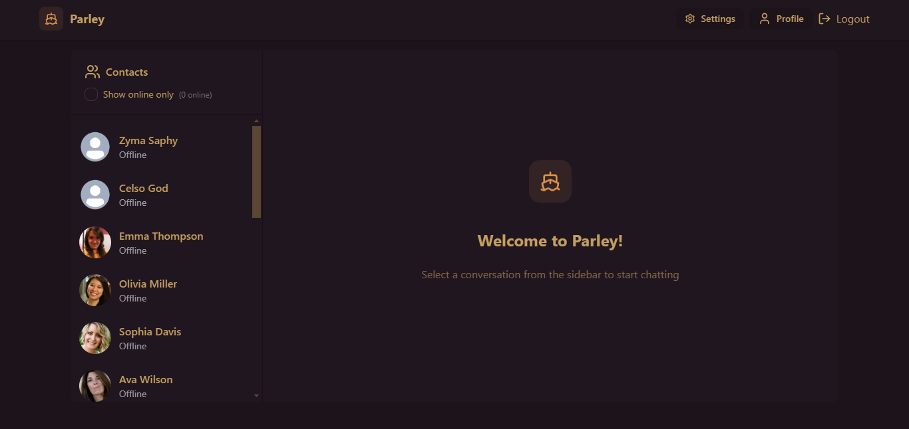

# Parley 🗨️

**Parley** is a modern, full-stack chat application built with the MERN stack, designed for seamless real-time communication. Whether you're connecting with friends, collaborating with a team, or building a community, Parley provides a responsive, user-friendly platform for instant messaging.

 <!-- Replace with an actual screenshot -->

## Features

- **Real-Time Messaging**: Instant and efficient messaging powered by Socket.io.
- **User Authentication**: Secure sign-up and login functionality.
- **Responsive Design**: Built with TailwindCSS and Daisy UI for an elegant and consistent UI across devices.
- **Search and Filter**: Easily find users and messages within the app.
- **Dark Mode**: User-friendly light and dark theme switching.
- **Scalable Architecture**: Designed to handle multiple concurrent users seamlessly.

## Tech Stack

- **Frontend**:
  - [React](https://reactjs.org/) - For building the user interface.
  - [TailwindCSS](https://tailwindcss.com/) - For styling and responsiveness.
  - [Daisy UI](https://daisyui.com/) - For pre-designed components and themes.
  - [Vite](https://vite.dev/) - For pre-designed components and themes.

- **Backend**:
  - [Node.js](https://nodejs.org/) - JavaScript runtime.
  - [Express](https://expressjs.com/) - Web framework for building the API.
  - [Socket.io](https://socket.io/) - For real-time, bi-directional communication.

- **Database**:
  - [MongoDB](https://www.mongodb.com/) - For storing user data and messages.

- **Authentication**:
  - [JWT](https://jwt.io/) - For secure authentication and session handling.
